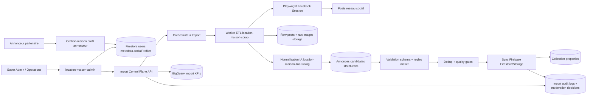

# Architecture Operationnelle Complete - Import Annonces Reseaux Sociaux

## 1. Objectif

Industrialiser le flux suivant, avec tracabilite et controle qualite:

1. Recuperer des annonces publiees par des annonceurs partenaires sur leurs reseaux sociaux.
2. Transformer ces contenus en annonces structurees compatibles `location-maison`.
3. Publier ces annonces sur la plateforme sous le compte du bon annonceur.
4. Permettre le pilotage et la moderation depuis `location-maison-admin`.

Ce document couvre l'architecture operationnelle cible, sans code.

## 2. Contexte et perimetre

### 2.1 Cas d'usage metier

- Des annonceurs donnent leur accord pour reutiliser leurs annonces publiees sur Facebook (et potentiellement autres reseaux ensuite).
- L'equipe TTN importe ces annonces en fin de mois (ou selon frequence definie).
- Les annonces importees enrichissent le catalogue de `tonnkama.com`.

### 2.2 Repartition des projets (decision verrouillee)

- `location-maison`: plateforme produit (publication annonce, profil annonceur, catalogue).
- `location-maison-admin`: pilotage, supervision, moderation, import review.
- `location-maison-scrap`: orchestration ETL (scrape -> format -> images -> sync Firebase).
- `location-maison-fine-tuning`: normalisation IA vers schema annonce cible.
- `location-maison-model-annonce`: experimentation/training R&D (hors runtime operationnel).

## 3. Etat actuel et cible

### 3.1 Etat actuel

- Le pipeline operationnel est deja porte par `location-maison-scrap`:
  - `pipeline:run` pour scrape + format + enrichissement images.
  - `firebase:sync` pour publication Firestore/Storage.
- Le modele de normalisation est deja consomme depuis `location-maison-fine-tuning`.
- Les reseaux sociaux annonceur sont geres dans les metadonnees profil annonceur.

### 3.2 Cible

- Passer d'un usage "operateur local" a une chaine "gouvernee et auditable":
  - gouvernance explicite par source,
  - run planifie,
  - validation qualite,
  - publication controlee,
  - monitoring metier.

## 4. Architecture cible (vue composants)



## 5. Flux operationnel detaille

## 5.1 Etape 0 - Qualification source

- Lier la source reseau social a `announcerUid`.
- Marquer le statut source: `active | paused | revoked`.

## 5.2 Etape 1 - Collecte

- Le worker Playwright ouvre la source annonceur (page, profil, groupe/user).
- Extraction post par post:
  - texte brut,
  - URL source,
  - horodatage publication,
  - medias associes.
- Ecriture en stockage brut + signature dedup (`sourceHashSignature`).

## 5.3 Etape 2 - Normalisation IA

- Chaque post brut passe dans le normaliseur (`location-maison-fine-tuning`).
- Sortie attendue: JSON annonce compatible schema `location-maison`.
- Rejet automatique si schema invalide ou donnees incompletes critiques.

## 5.4 Etape 3 - Controle qualite

- Validation metier:
  - champs obligatoires,
  - coherences prix/surface/type/localisation,
  - nombre max tags/images.
- Dedup:
  - idempotence par `rawPostId` + URL + signature.
  - comparaison avec stock `properties` existant.
- Classification:
  - `ready_to_publish`,
  - `needs_review`,
  - `rejected`.

## 5.5 Etape 4 - Publication

- Les candidats `ready_to_publish` sont sync vers Firestore/Storage.
- Attribution stricte:
  - `createdBy = announcerUid` cible,
  - champs source renseignes (`sourceRawPostId`, `sourcePostUrl`, etc.).
- Etat initial recommande: `IN_PROGRESS` (modifiable par moderation).

## 5.6 Etape 5 - Supervision admin

- Dashboard admin:
  - jobs import,
  - statuts des annonces importees,
  - erreurs et motifs de rejet,
  - liens vers annonce source,
  - actions de moderation.

## 6. Architecture des donnees

## 6.1 Profil annonceur (source de verite reseaux)

- Conserver le stockage dans `users.metadata.socialProfiles` pour coherence plateforme.
- Structure cible:
  - `facebook: { url, handle }`
  - `instagram: { url, handle }`
  - `tiktok: { url, handle }`
  - `linkedin: { url, handle }`
  - `x: { url, handle }`

## 6.2 Registry des sources importables (nouveau)

Collection recommandee: `announcer_import_sources`.

Champs minimaux:

- `announcerUid`
- `platform` (`facebook`, puis extensible)
- `sourceUrl`
- `sourceType` (`profile`, `page`, `group_user`)
- `status` (`active`, `paused`, `revoked`)
- `lastImportAt`
- `createdAt`, `updatedAt`

## 6.3 Job tracking (nouveau)

Collection recommandee: `social_import_jobs`.

Champs minimaux:

- `jobId`
- `mode` (`manual`, `scheduled`)
- `environment` (`dev`, `prod`)
- `announcerScope` (uids cibles)
- `startedAt`, `endedAt`
- `status` (`running`, `completed`, `failed`, `partial`)
- `counters`:
  - `rawFetched`
  - `normalizedOk`
  - `needsReview`
  - `published`
  - `rejected`
- `errorSummary`
- `triggeredBy` (admin uid ou scheduler)

## 6.4 Historique de decisions (nouveau)

Collection recommandee: `social_import_decisions`.

Champs minimaux:

- `jobId`
- `announcerUid`
- `rawPostId`
- `decision` (`publish`, `reject`, `archive_duplicate`, `retry`)
- `reason`
- `actorId`
- `createdAt`

## 6.5 Stockage brut scrape (decision verrouillee)

### Buckets GCP/Firebase Storage

- `social-import-raw-dev`
- `social-import-raw-prod`

Note pratique:

- Si contrainte de nom global GCS (deja pris), garder le meme pattern en suffixant par projet:
  - `social-import-raw-dev-location-maison-dev`
  - `social-import-raw-prod-location-maison-prod-167da`

### Arborescence de reference

```text
gs://social-import-raw-{env}/
  facebook/
    {announcerUid}/
      {YYYY}/
        {MM}/
          {jobId}/
            raw-posts/
              {rawPostId}.json
            raw-images/
              {rawPostId}/
                001.jpg
                002.jpg
            processed-posts/
              {rawPostId}.processed.json
            candidates/
              {rawPostId}.candidate.json
            manifests/
              job-summary.json
              mapping-raw-to-candidate.json
            errors/
              {rawPostId}.error.json
```

Regles:

- Les donnees brutes restent dans le bucket (source de verite pour reprocessing et dataset evolutif).
- Firestore ne stocke que les metadonnees de pilotage (`announcer_import_sources`, `social_import_jobs`, `social_import_decisions`, `social_import_candidates`).
- Les annonces publiees restent dans `properties` + images finales dans le storage produit.

### Retention (etat actuel)

- Pas de lifecycle delete automatique pour le moment.
- Pas de purge automatique tant que la gouvernance dataset evolutif n'est pas finalisee.
- Suppression manuelle uniquement, apres validation explicite:
  - "annonce scrapee integree dans dataset"
  - et "aucun besoin de reprocessing brut".

Decision explicite:

- `Retention policy = desactivee (pour l'instant)`.
- Un lot dedie definira plus tard la politique "dataset-linked cleanup".

## 7. Gouvernance, securite, conformite

## 7.1 Secrets et credentials

- Interdiction de stocker un mot de passe Facebook en clair dans le repo.
- Utiliser un `session_state` Playwright chiffre + rotation periodique.
- Secrets centralises via Secret Manager (ou equivalent), separes `dev/prod`.

## 7.2 Conformite operationnelle

- Import autorise uniquement pour sources actives.
- Traiter les demandes de retrait via `status=revoked` immediate.
- Journaliser toute importation avec `who/when/what`.

## 7.3 RBAC admin

Permissions recommandees:

- `social_import.read`
- `social_import.run`
- `social_import.review`
- `social_import.publish`
- `social_import.reject`
- `social_import.settings`

Regle: deny-by-default sur UI + API.

## 8. Orchestration et exploitation

## 8.1 Modes d'execution

- Mode A (actuel): execution manuelle operateur.
- Mode B (cible): ordonnanceur mensuel + execution on-demand.

## 8.2 Planification recommandee

- Frequence de base: fin de mois par annonceur actif.
- Capacite d'execution ad hoc: import ponctuel si annonceur demande mise a jour.
- Politique retry:
  - retry automatique sur erreurs techniques transitoires,
  - retry manuel sur erreurs metier apres correction.

## 8.3 Runbook operationnel mensuel

1. Verifier sources actives.
2. Lancer dry-run en `dev`.
3. Valider echantillon qualite.
4. Lancer run `prod`.
5. Controler KPIs publication et rejet.
6. Traiter les `needs_review`.
7. Cloturer le job avec rapport.

## 9. Qualite et dedup

## 9.1 Principes

- Aucune publication sans trace source.
- Aucune duplication si meme source logique detectee.
- Aucune suppression definitive automatique.

## 9.2 Regles dedup operationnelles

- Dedup fort:
  - `sourceRawPostId` deja publie,
  - URL source identique.
- Dedup faible:
  - signature texte + prix + zone proche.
- Sortie dedup:
  - `suspected`, `confirmed`, `resolved` (coherent avec module doublons admin).

## 10. Observabilite et KPIs

## 10.1 KPIs pipeline

- `import_success_rate`
- `normalization_success_rate`
- `publish_rate`
- `reject_rate`
- `mean_processing_time_per_post`

## 10.2 KPIs business

- `published_posts_by_announcer`
- `active_listings_from_social_import`
- `leads_generated_on_imported_listings` (phase suivante)

## 10.3 Alerting

- Alerte si `publish_rate` chute fortement.
- Alerte si `reject_rate` depasse un seuil.
- Alerte si source active sans import sur periode attendue.

## 11. Environnements et isolation

- `dev`:
  - test pipeline + validation schema + publication sur projet Firebase dev.
- `prod`:
  - publication live catalogue.
- Interdictions:
  - jamais de credentials prod dans environnement dev,
  - jamais de publication prod depuis un job non marque prod.

## 12. Roadmap d'implementation (sans code ici)

## 12.1 Lot 1 - Gouvernance source

- Registry `announcer_import_sources`.
- Statut source.
- Ecrans admin lecture/edition source import.

## 12.2 Lot 2 - Control plane admin

- Ecran jobs import.
- Lancement manuel par annonceur/periode.
- Vue erreurs + retries.

## 12.3 Lot 3 - Industrialisation orchestration

- Planification mensuelle.
- Retry policy.
- Alerting standard.

## 12.4 Lot 4 - Optimisation qualite

- Tuning dedup avance.
- Benchmark normalisation par type annonce.
- Amelioration continue des rejets metier.

## 13. Decisions verrouillees

- Le runtime operationnel d'import reseaux sociaux repose sur `location-maison-scrap`.
- La normalisation annonce reste dans `location-maison-fine-tuning`.
- `location-maison-model-annonce` reste un espace R&D et non un composant d'execution prod.
- Toute annonce importee doit garder une provenance complete et un rattachement annonceur explicite.
