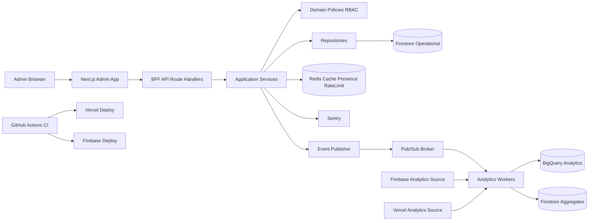

# Architecture Overview

## 1. Vision d'architecture

Le dashboard admin sera construit comme un **modular monolith Next.js** avec separation nette:

- Presentation (UI admin)
- Application services (use cases)
- Domain (regles metier et RBAC)
- Infrastructure adapters (Firestore, Redis, Firebase, Vercel Analytics, Sentry, broker)

Ce choix privilegie:

- vitesse d'execution MVP
- simplicite operationnelle
- evolutivite vers services separes si necessaire

## 2. Vue globale des composants

## 3. Choix technologiques explicites

| Brique | Decision MVP | Statut | Rationale |
|---|---|---|---|
| Frontend + BFF | Next.js 16 (App Router + Route Handlers) | Utilise | Vitesse, SSR/Server Components, BFF naturel |
| Component library | shadcn/ui + Radix + Tailwind | Utilise | Base accesible + controle design system interne |
| Icons | lucide-react | Utilise | Standard unique dashboard |
| Global state | Zustand + TanStack Query + Context minimal | Utilise | Separation claire client state / server state |
| Auth | Firebase Auth | Utilise | Aligne avec `location-maison` |
| DB operationnelle | Firestore | Utilise | Donnees deja dans ecosysteme Firebase |
| Stockage assets | Firebase Storage | Utilise | Cohesion stack Firebase |
| Serverless jobs | Cloud Functions | Utilise | Ingestion et traitements async simples |
| Cache/presence | Redis (managed type Upstash/Redis Cloud) | Utilise | Presence temps reel, rate-limit, cache KPI |
| Broker async | Google Pub/Sub | Utilise | Simple a operer dans GCP, suffisant MVP |
| Kafka | Non retenu MVP | Ecarte MVP | Surcout ops inutile au volume initial |
| Error monitoring | Sentry | Utilise | Observabilite erreurs FE/BE centralisee |
| Product analytics source | Firebase Analytics | Utilise | Source officielle ecosysteme Firebase |
| Runtime analytics source | Vercel Analytics | Utilise | Vision trafic cote plateforme |
| Data warehouse | BigQuery | Utilise | Agregations analytiques robustes |
| CI/CD | GitHub Actions | Utilise | Repo et workflows existants |
| GitLab CI | Non retenu | Ecarte | Eviter double pipeline et drift |
| Containerisation locale | Docker | Utilise | Reproductibilite environnement local |
| Deploy web | Vercel | Utilise | Hosting Next.js admin |

## 4. Decision broker et Kafka

- **Broker retenu MVP:** Pub/Sub.
- **Kafka non retenu MVP:** aucun besoin de throughput/partitioning avances justifiant la complexite.
- **Criteres de re-evaluation Kafka (phase future):**
- > 50k events/min soutenus
- > 5 consumers independants avec besoins de replay intensif
- exigences de stream processing avancees (exactly-once stricte cross-domain)

## 5. Topologie d'environnements

- `local`: Docker + emulateurs Firebase + Redis local.
- `dev`: Vercel dev + Firebase dev + Redis dev + Sentry dev.
- `preprod`: environnement quasi prod.
- `prod`: isolement strict credentials/projets.

## 6. NFR cibles (MVP)

- Disponibilite dashboard: 99.5%+
- p95 APIs lecture admin: < 400 ms
- p95 APIs mutation admin: < 700 ms
- Tracabilite actions sensibles: 100%
- RPO analytics: <= 15 min
- RTO service admin: <= 1h

## 7. Risques et mitigations

- Risque: divergence de KPI Firebase vs Vercel.
- Mitigation: afficher la source et la formule de calcul par KPI.
- Risque: point de contention Firestore sur agregats.
- Mitigation: agregations pre-calculees + cache Redis.
- Risque: drift de permissions RBAC.
- Mitigation: matrice versionnee + tests de regression d'autorisation.
